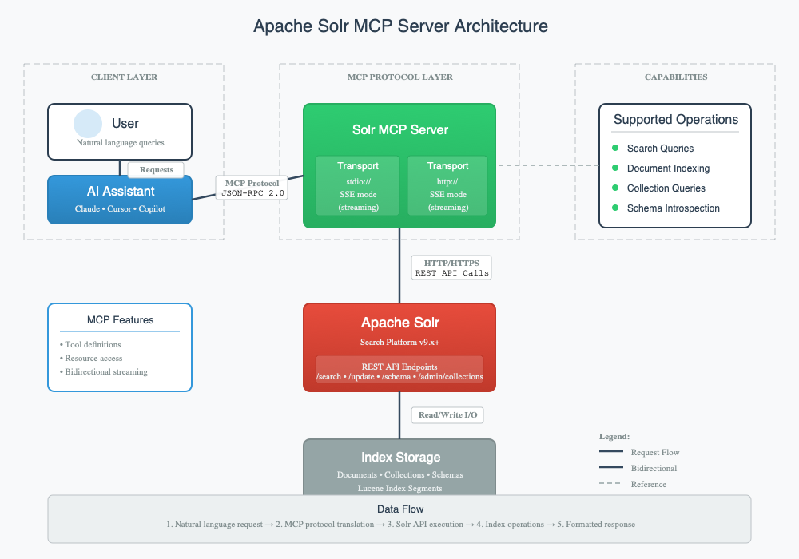

# Announcing Apache Solr MCP Server: Bringing Enterprise Search into Your AI Workflow

AI is revolutionizing how developers interact with enterprise systems, making complex operations accessible through
natural language conversations. But when it comes to search infrastructure, developers still face a challenging reality:
building and debugging Solr queries, managing collections, and analyzing schemas often requires deep expertise and
constant context-switching between documentation, CLI tools, and the Solr Admin UI.

Today we're excited to announce the experimental release of the **Apache Solr MCP Server
** ([SOLR-17944](https://issues.apache.org/jira/browse/SOLR-17944)), a groundbreaking integration that brings Apache
Solr's powerful search and indexing capabilities directly into your AI-powered development workflow.

Apache Solr is the blazing-fast, open-source enterprise search platform trusted by organizations worldwide for building
sophisticated search applications. With the Solr MCP Server, your favorite AI coding agents can now interact seamlessly
with Solr, making search operations as simple as having a conversation.

## What is the Apache Solr MCP Server?

The Apache Solr MCP Server is a Model Context Protocol (MCP) server implementation that enables AI agents to communicate
directly with your Apache Solr instance. Built as a first-party Apache project, it supports both stdio and streamable
HTTP transport modes, providing flexible integration options for different development environments.

By acting as a bridge between AI assistants and Solr's comprehensive API, the MCP server allows developers to perform
complex search operations, manage collections, index documents, and analyze schemas without ever leaving their IDE or
chat interface.

## Key Capabilities

The Apache Solr MCP Server transforms your AI coding agent from a simple assistant into a search infrastructure expert.
Here's what you can do:

**Search Operations**: Execute sophisticated Solr queries using natural language. Your AI agent can help you construct
complex queries, apply filters, configure facets, and retrieve results—all through conversation.

**Document Indexing**: Index documents directly through your AI agent.

**Collection Queries**: Explore collection configurations, understand your search architecture, and get insights into
your Solr deployment without manually navigating the Solr Admin UI.

**Schema Introspection**: Analyze field definitions, understand field types, explore copy fields, and get detailed
schema information—all by simply asking your AI agent.

## How It Works

The Apache Solr MCP Server acts as an intelligent intermediary between your AI assistant and Apache Solr, translating
natural language requests into Solr API calls and returning results in an easy-to-understand format.

Here's the flow:

1. **Developer Request**: You ask your AI assistant a question or give a command related to Solr (e.g., "Search for
   products with 'laptop' in the title")
2. **MCP Protocol**: The AI assistant communicates with the Solr MCP Server using the standardized Model Context
   Protocol
3. **Solr API Translation**: The MCP server translates the request into appropriate Solr API calls (Search API, Update
   API, Schema API, etc.)
4. **Solr Execution**: The request is executed against your Solr instance
5. **Response Processing**: Results are formatted and returned through the MCP protocol
6. **AI Interpretation**: Your AI assistant presents the results in natural language, often with additional insights and
   suggestions

This architecture ensures that your AI assistant has full visibility into your search operations while maintaining
security and following Solr's access controls.

## Technical Implementation

The Apache Solr MCP Server is implemented in Java, making it a natural fit within the Apache Solr ecosystem. Key
technical features include:

- **Dual Transport Support**: Stdio mode for CLI and desktop integrations, streamable HTTP for web-based applications
- **API Coverage**: Supports search, indexing, collection queries, and schema introspection
- **Enterprise-Ready**: Built with the same reliability and performance standards as Apache Solr itself
- **Extensible Architecture**: Designed to grow with new Solr features and community contributions

## Integrations & Compatibility

As an MCP server, the Apache Solr MCP Server integrates with a growing ecosystem of AI assistants and development tools:

- **Claude Family**: Use Claude, Claude Code, or Claude Desktop to interact with your Solr instances through natural
  conversation
- **Cursor IDE**: Seamlessly integrate Solr operations into your development workflow within Cursor
- **GitHub Copilot**: Enhance Copilot with direct access to your search infrastructure
- **Windsurf, Zed, and More**: Compatible with any IDE or tool that supports the Model Context Protocol

## Use Cases

Here are some practical scenarios where the Solr MCP Server shines:

**Rapid Prototyping**: "Show me the schema for the product collection..." Your agent retrieves and explains the
collection structure.

**Query Development**: "Find all documents where the price is between $50 and $100 and category is electronics." Your
agent constructs the proper Solr query syntax and executes it.

**Debugging Search Results**: "Why isn't my query matching this document?" Your agent analyzes your schema, query
parameters, and document structure to identify the issue.

**Data Migration**: "Index these JSON documents into the products collection." Your agent handles the bulk indexing
operation and reports on success/failure.

**Performance Optimization**: "Analyze the schema for the catalog collection and suggest improvements." Your agent
reviews field definitions and provides optimization recommendations.

## Getting Started (Experimental Release)

The Apache Solr MCP Server is currently in experimental release as we gather community feedback and refine the
implementation. You can find the initial contribution in [Pull Request #1](https://github.com/apache/solr-mcp/pull/1) on
the apache/solr-mcp repository.

**Current Status**: Under review for integration into the Apache Solr project  
**Implementation**: Java-based, supports stdio and streamable HTTP transports  
**License**: Apache 2.0  
**Repository**: [github.com/apache/solr-mcp](https://github.com/apache/solr-mcp)

To try it out, you'll need:

- A running Apache Solr instance (9.x or later recommended)
- An MCP-compatible AI assistant (Claude, Cursor, etc.)
- Java 17 or higher for running the server

Detailed setup instructions and configuration examples are available in the repository README.

## The Road Ahead

This is just the beginning of bringing AI-powered workflows to Apache Solr. As we progress from experimental to stable
release, we're planning to add:

- **HTTP Server Security**: Implementing authentication and authorization mechanisms for secure HTTP transport mode
- **Docker Distribution**: Publishing official Docker images for easy deployment and containerized environments
- **Registry Publication**: Making the server available on GitHub MCP Registry and other MCP marketplaces for seamless
  discovery and installation
- **Expanded API Coverage**: Adding support for more Solr APIs including collection management, and administrative
  operations

## Join the Community

The Apache Solr MCP Server is an open-source project that thrives on community contributions. Whether you're a Solr
expert, an AI enthusiast, or someone who sees the potential of this integration, we welcome your involvement:

- **Try it out**: Download the experimental release and share your feedback
- **Contribute**: Submit issues, suggestions, or pull requests on GitHub
- **Discuss**: Join the conversation on
  the [Apache Solr mailing lists](https://solr.apache.org/community.html#mailing-lists-chat)
- **Improve**: Help us refine the API, add new capabilities, and improve documentation

## Conclusion

The Apache Solr MCP Server represents a new paradigm in how developers interact with search infrastructure. By bringing
Solr's capabilities directly into AI-powered development workflows, we're removing barriers, accelerating development,
and making enterprise search more accessible than ever.

We're excited to see how the community uses this tool and what creative applications emerge. The future of search
development is conversational, and with the Apache Solr MCP Server, that future starts today.

**Get started now**: Visit [github.com/apache/solr-mcp](https://github.com/apache/solr-mcp) and bring AI-powered search
operations to your workflow.

---

*This is an experimental release. Features and APIs are subject to change based on community feedback. For production
use, please wait for the stable release announcement.*