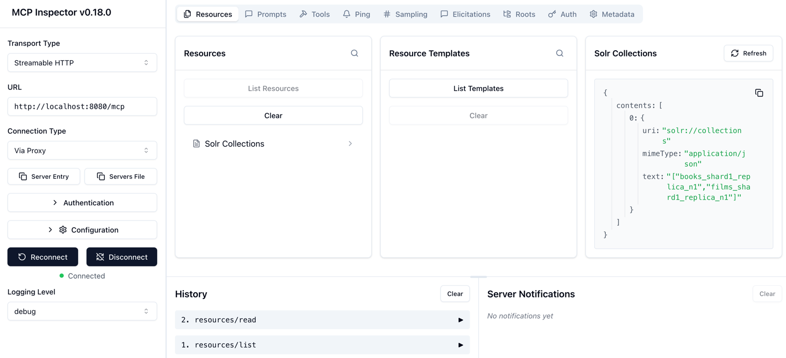
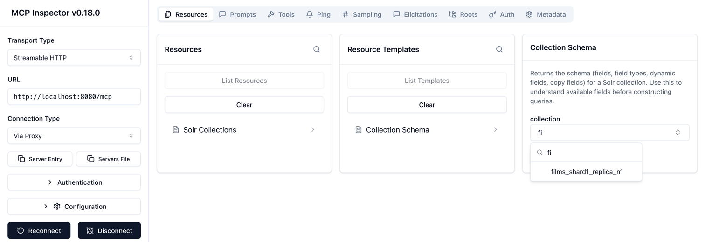
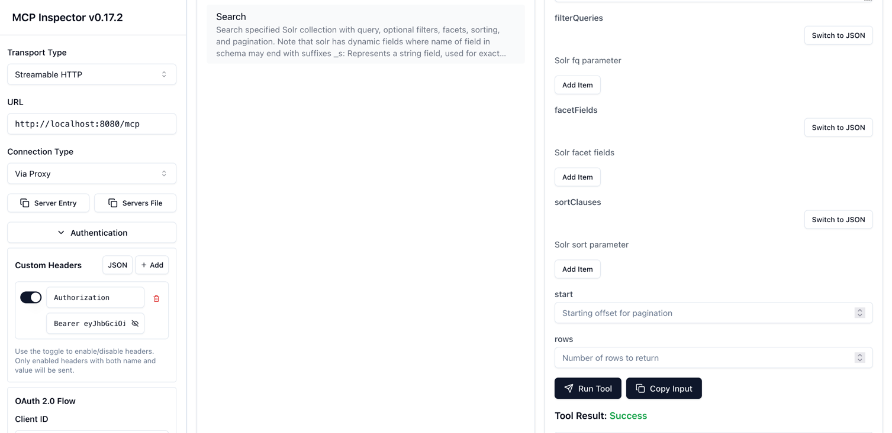
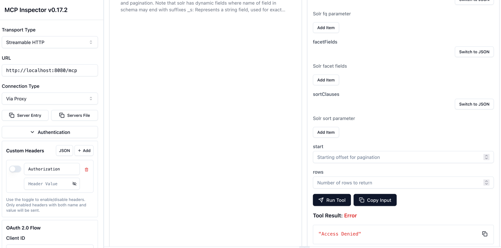

[](https://github.com/apache/solr-mcp)

# Solr MCP Server

A Spring AI Model Context Protocol (MCP) server that provides tools for interacting with Apache Solr. Enables AI assistants like Claude to search, index, and manage Solr collections through the MCP protocol.

## What's inside

- 🔍 Search Solr collections with filtering, faceting, and pagination
- 📝 Index documents in JSON, CSV, and XML
- 📊 Manage collections and view statistics
- 🔧 Inspect schema
- 🔌 Transports: STDIO (Claude Desktop) and HTTP (MCP Inspector)
- 🔐 OAuth2 security with Auth0 (HTTP mode only)
- 🐳 Docker images built with Jib

## Get started (users)

- Prerequisites: Java 25+, Docker (and Docker Compose), Git
- Start Solr with sample data:
  ```bash
  docker compose up -d
  ```
- Run the server:
    - **STDIO mode (default)**:
        - Gradle:
          ```bash
          ./gradlew bootRun
          ```
        - JAR:
          ```bash
          ./gradlew build
          java -jar build/libs/solr-mcp-1.0.0-SNAPSHOT.jar
          ```
        - Docker:
          ```bash
          docker run -i --rm ghcr.io/apache/solr-mcp:latest
          ```
    - **HTTP mode**:
        - Gradle:
          ```bash
          PROFILES=http ./gradlew bootRun
          ```
        - JAR:
          ```bash
          PROFILES=http java -jar build/libs/solr-mcp-1.0.0-SNAPSHOT.jar
          ```
        - Docker:
          ```bash
          docker run -p 8080:8080 --rm -e PROFILES=http ghcr.io/apache/solr-mcp:latest
          ```

For more options (custom SOLR_URL, Linux host networking) see the Deployment Guide: docs/DEPLOYMENT.md

### Claude Desktop

Add this to your Claude Desktop config (macOS path shown); then restart Claude.

**STDIO mode (default)**

Using Docker:
```json
{
  "mcpServers": {
    "solr-mcp": {
      "command": "docker",
      "args": ["run", "-i", "--rm", "ghcr.io/apache/solr-mcp:latest"],
        "env": {
            "SOLR_URL": "http://localhost:8983/solr/"
        }
    }
  }
}
```

Using JAR:

```json
{
    "mcpServers": {
        "solr-mcp": {
            "command": "java",
            "args": [
                "-jar",
                "/absolute/path/to/solr-mcp-1.0.0-SNAPSHOT.jar"
            ],
            "env": {
                "SOLR_URL": "http://localhost:8983/solr/"
            }
        }
    }
}
```

**HTTP mode**

Using Docker:

```json
{
    "mcpServers": {
        "solr-mcp": {
            "command": "docker",
            "args": [
                "run",
                "-p",
                "8080:8080",
                "--rm",
                "ghcr.io/apache/solr-mcp:latest"
            ],
            "env": {
                "PROFILES": "http",
                "SOLR_URL": "http://localhost:8983/solr/"
            }
        }
    }
}
```

Using JAR:

```json
{
    "mcpServers": {
        "solr-mcp": {
            "command": "java",
            "args": [
                "-jar",
                "/absolute/path/to/solr-mcp-1.0.0-SNAPSHOT.jar"
            ],
            "env": {
                "PROFILES": "http",
                "SOLR_URL": "http://localhost:8983/solr/"
            }
    }
  }
}
```

**Connecting to a running HTTP server**

If you already have the MCP server running in HTTP mode (via Gradle, JAR, or Docker), you can connect Claude Desktop to
it using `mcp-remote`:

Running via Gradle:

```bash
PROFILES=http ./gradlew bootRun
```

Running locally (JAR):

```bash
PROFILES=http java -jar build/libs/solr-mcp-1.0.0-SNAPSHOT.jar
```

Running via Docker:

```bash
docker run -p 8080:8080 --rm -e PROFILES=http ghcr.io/apache/solr-mcp:latest
```

Then add to your `claude_desktop_config.json`:

```json
{
    "mcpServers": {
        "solr-mcp-http": {
            "command": "npx",
            "args": [
                "mcp-remote",
                "http://localhost:8080/mcp"
            ]
        }
    }
}
```

More configuration options: docs/DEPLOYMENT.md#docker-images-with-jib

## Security (OAuth2)

The Solr MCP server supports OAuth2 authentication when running in HTTP mode, providing secure access control for your
MCP tools.

### Features

- **OAuth2 Resource Server**: JWT token validation using Auth0 (or any OAuth2 provider)
- **HTTP Mode Only**: Security is only active when using the `http` profile
- **CORS Support**: Enabled for MCP Inspector compatibility
- **Machine-to-Machine**: Uses Client Credentials flow for service authentication

### Quick Setup

1. **Configure Auth0** (see detailed guide: [docs/AUTH0_SETUP.md](docs/AUTH0_SETUP.md))
    - Create an Auth0 Application (Machine to Machine)
    - Create an Auth0 API with your audience identifier
    - Note your Domain, Client ID, Client Secret, and Audience

2. **Set Environment Variable**:
   ```bash
   export OAUTH2_ISSUER_URI=https://your-tenant.auth0.com/
   export PROFILES=http
   ```

3. **Run the Server**:
   ```bash
   ./gradlew bootRun
   ```

4. **Get Access Token** (using convenience script):
   ```bash
   ./scripts/get-auth0-token.sh --domain your-tenant.auth0.com \
     --client-id YOUR_CLIENT_ID \
     --client-secret YOUR_CLIENT_SECRET \
     --audience https://solr-mcp-api
   ```

5. **Use the Token**:
   ```bash
   curl -H "Authorization: Bearer YOUR_TOKEN" \
     http://localhost:8080/mcp
   ```

For complete setup instructions, see [docs/AUTH0_SETUP.md](docs/AUTH0_SETUP.md)

## Available MCP tools

| Tool | Description |
|------|-------------|
| `search` | Search Solr collections with advanced query options |
| `index_documents` | Index documents from JSON, CSV, or XML |
| `listCollections` | List all available Solr collections |
| `getCollectionStats` | Get statistics and metrics for a collection |
| `checkHealth` | Check the health status of a collection |
| `getSchema` | Retrieve schema information for a collection |

## Available MCP Resources

MCP Resources provide a way to expose data that can be read by MCP clients. The Solr MCP Server provides the following resources:

| Resource URI | Description |
|--------------|-------------|
| `solr://collections` | List of all Solr collections available in the cluster |
| `solr://{collection}/schema` | Schema definition for a specific collection (supports autocompletion) |

### Resource Autocompletion

The `solr://{collection}/schema` resource supports autocompletion for the `{collection}` parameter. MCP clients can use the completion API to get a list of available collection names.





## Screenshots

- Claude Desktop (STDIO):

  

- MCP Inspector (HTTP):

  

- MCP Inspector (HTTP with OAuth2 - Success):

  

- MCP Inspector (HTTP with OAuth2 - Failure):

  

- MCP Inspector (STDIO):

  

## Documentation

- [Auth0 Setup (OAuth2 configuration)](docs/AUTH0_SETUP.md)

## Contributing

We welcome contributions!

- Start here: [CONTRIBUTING.md](CONTRIBUTING.md)

## Support

- Issues: https://github.com/apache/solr-mcp/issues
- Discussions: https://github.com/apache/solr-mcp/discussions

## License

Apache License 2.0 — see LICENSE

## Acknowledgments

Built with:

- Spring AI MCP — https://spring.io/projects/spring-ai
- Apache Solr — https://solr.apache.org/
- Jib — https://github.com/GoogleContainerTools/jib
- Testcontainers — https://www.testcontainers.org/
- Spring AI MCP Security — https://github.com/spring-ai-community/mcp-security