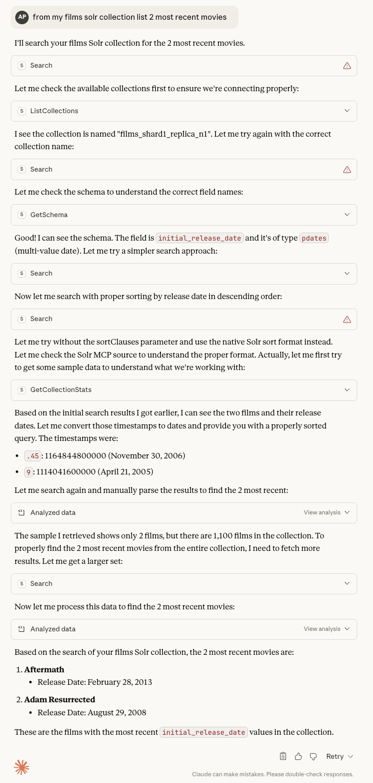
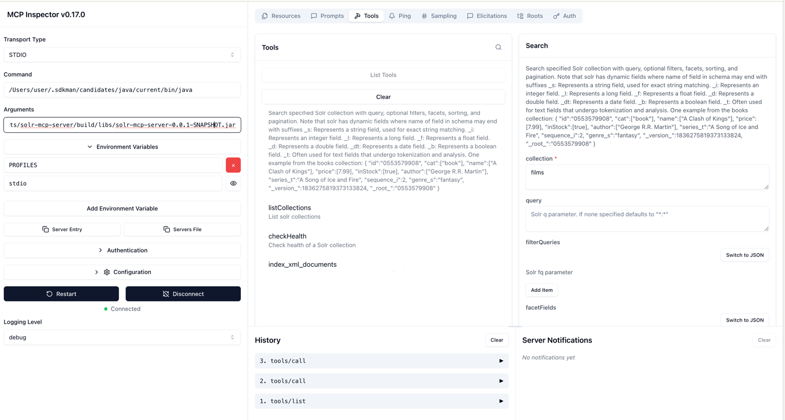
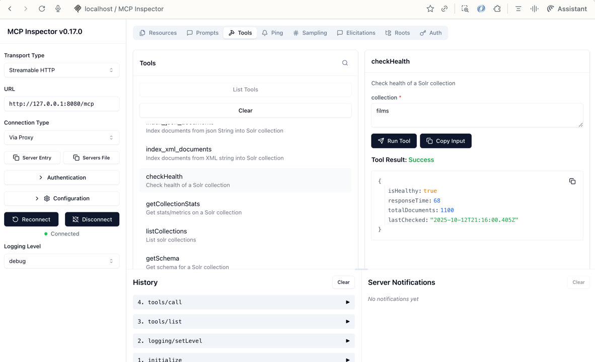

[](https://github.com/apache/solr-mcp)
# Solr MCP Server

A Spring AI Model Context Protocol (MCP) server that provides tools for interacting with Apache Solr. This server
enables AI assistants like Claude to search, index, and manage Solr collections through the MCP protocol.

## Overview

This project provides a set of tools that allow AI assistants to interact with Apache Solr, a powerful open-source
search platform. By implementing the Spring AI MCP protocol, these tools can be used by any MCP-compatible client,
including Claude Desktop. The project uses SolrJ, the official Java client for Solr, to communicate with Solr instances.

The server provides the following capabilities:

- Search Solr collections with advanced query options
- Index documents into Solr collections
- Manage and monitor Solr collections
- Retrieve and analyze Solr schema information

### Transport Profiles

The server supports two transport modes:

- **STDIO (Standard Input/Output)** - Recommended for local development and production use with Claude Desktop. This is
  the default and most secure option for local deployments.
- **HTTP (Streamable HTTP)** - For testing with MCP Inspector and remote deployments. ⚠️ **Note:** HTTP
  mode is inherently insecure without additional security measures (see Security Considerations below).

## Prerequisites

- Java 25 or higher
- Docker and Docker Compose (for running Solr)
- Gradle 9.1.0+ (wrapper included in project)

## Installation and Setup

### 1. Clone the repository

```bash
git clone https://github.com/yourusername/solr-mcp-server.git
cd solr-mcp-server
```

### 2. Start Solr using Docker Compose

```bash
docker-compose up -d
```

This will start a Solr instance in SolrCloud mode with ZooKeeper and create two sample collections:

- `books` - A collection with sample book data
- `films` - A collection with sample film data

### 3. Build the Project

This project uses Gradle with version catalogs for dependency management. All dependencies and their versions are
centrally managed in `gradle/libs.versions.toml`.

```bash
# Build the project and run tests
./gradlew build

# Build without tests (faster)
./gradlew assemble

# Clean and rebuild
./gradlew clean build
```

The build produces two JAR files in `build/libs/`:

- `solr-mcp-server-0.0.1-SNAPSHOT.jar` - Executable JAR with all dependencies (fat JAR)
- `solr-mcp-server-0.0.1-SNAPSHOT-plain.jar` - Plain JAR without dependencies

### 4. Building Docker Images (Optional)

This project uses [Jib](https://github.com/GoogleContainerTools/jib) to build optimized Docker images without requiring
Docker installed. Jib creates layered images for faster rebuilds and smaller image sizes.

#### Option 1: Build to Docker Daemon (Recommended)

Build directly to your local Docker daemon (requires Docker installed):

```bash
./gradlew jibDockerBuild
```

This creates a local Docker image: `solr-mcp-server:0.0.1-SNAPSHOT`

Verify the image:

```bash
docker images | grep solr-mcp-server
```

#### Option 2: Build to Tar File (No Docker Required)

Build to a tar file without Docker installed:

```bash
./gradlew jibBuildTar
```

This creates `build/jib-image.tar`. Load it into Docker:

```bash
docker load < build/jib-image.tar
```

#### Option 3: Push to Docker Hub

Authenticate with Docker Hub and push:

```bash
# Login to Docker Hub
docker login

# Build and push
./gradlew jib -Djib.to.image=YOUR_DOCKERHUB_USERNAME/solr-mcp-server:0.0.1-SNAPSHOT
```

#### Option 4: Push to GitHub Container Registry

Authenticate with GitHub Container Registry and push:

```bash
# Create a Personal Access Token (classic) with write:packages scope at:
# https://github.com/settings/tokens

# Login to GitHub Container Registry
export GITHUB_TOKEN=YOUR_GITHUB_TOKEN
echo $GITHUB_TOKEN | docker login ghcr.io -u YOUR_GITHUB_USERNAME --password-stdin

# Build and push
./gradlew jib -Djib.to.image=ghcr.io/YOUR_GITHUB_USERNAME/solr-mcp-server:0.0.1-SNAPSHOT
```

#### Multi-Platform Support

The Docker images are built with multi-platform support for:

- `linux/amd64` (Intel/AMD 64-bit)
- `linux/arm64` (Apple Silicon M1/M2/M3)

#### Automated Builds with GitHub Actions

This project includes a GitHub Actions workflow that automatically builds and publishes Docker images to both GitHub
Container Registry and Docker Hub.

**Triggers:**

- Push to `main` branch - Builds and publishes images tagged with `version-SHA` and `latest`
- Version tags (e.g., `v1.0.0`) - Builds and publishes images tagged with the version number and `latest`
- Pull requests - Builds and tests only (no publishing)

**Published Images:**

- GitHub Container Registry: `ghcr.io/OWNER/solr-mcp-server:TAG`
- Docker Hub: `DOCKERHUB_USERNAME/solr-mcp-server:TAG`

**Setup for Docker Hub Publishing:**

To enable Docker Hub publishing, configure these repository secrets:

1. Go to your GitHub repository Settings > Secrets and variables > Actions
2. Add the following secrets:
    - `DOCKERHUB_USERNAME`: Your Docker Hub username
    - `DOCKERHUB_TOKEN`: Docker Hub access token (create at https://hub.docker.com/settings/security)

**Note:** GitHub Container Registry publishing works automatically using the `GITHUB_TOKEN` provided by GitHub Actions.

#### Running the Docker Container

Run the container with STDIO mode:

```bash
docker run -i --rm solr-mcp-server:0.0.1-SNAPSHOT
```

Or with custom Solr URL:

```bash
docker run -i --rm \
  -e SOLR_URL=http://your-solr-host:8983/solr/ \
  solr-mcp-server:0.0.1-SNAPSHOT
```

**Note for Linux users:** If you need to connect to Solr running on the host machine, add the `--add-host` flag:

```bash
docker run -i --rm \
  --add-host=host.docker.internal:host-gateway \
  solr-mcp-server:0.0.1-SNAPSHOT
```

## Project Structure

The codebase follows a clean, modular architecture organized by functionality:

```
src/main/java/org/apache/solr/mcp/server/
├── Main.java                           # Application entry point
├── config/                             # Configuration classes
│   ├── SolrConfig.java                # Solr client bean configuration
│   └── SolrConfigurationProperties.java # Solr connection properties
├── search/                             # Search functionality
│   ├── SearchService.java             # MCP tool for searching Solr
│   └── SearchResponse.java            # Search result DTOs
├── indexing/                           # Document indexing functionality
│   ├── IndexingService.java           # MCP tool for indexing documents
│   └── documentcreator/               # Document format parsers
│       ├── IndexingDocumentCreator.java    # Interface for document creators
│       ├── JsonDocumentCreator.java        # JSON document parser
│       ├── CsvDocumentCreator.java         # CSV document parser
│       ├── XmlDocumentCreator.java         # XML document parser
│       ├── SolrDocumentCreator.java        # Factory for document creators
│       ├── FieldNameSanitizer.java         # Field name sanitization utility
│       └── DocumentProcessingException.java # Indexing exceptions
└── metadata/                           # Collection management functionality
    ├── CollectionService.java         # MCP tools for collection operations
    ├── SchemaService.java             # MCP tool for schema retrieval
    ├── CollectionUtils.java           # Collection utility methods
    └── Dtos.java                      # Collection-related DTOs (records)
```

### Key Components

- **MCP Tools**: Service classes annotated with `@McpTool` expose functionality to AI assistants
    - `SearchService` - Search queries with filtering, faceting, and pagination
    - `IndexingService` - Document indexing with support for JSON, CSV, and XML formats
    - `CollectionService` - Collection management (list, stats, health checks)
    - `SchemaService` - Schema introspection

- **Configuration**: Spring Boot configuration using properties files
    - `application.properties` - Default configuration
    - `application-stdio.properties` - STDIO transport profile
    - `application-http.properties` - HTTP transport profile

- **Document Creators**: Strategy pattern implementation for parsing different document formats
    - Automatically sanitizes field names to comply with Solr schema requirements
    - Supports nested JSON structures and multi-valued fields

- **DTOs**: Java records for immutable data transfer objects (removed Lombok dependency)

## Available Tools

The server provides the following tools that can be used by MCP clients:

### 1. Search

Search a Solr collection with advanced query options.

```
Tool: Search
Description: Search specified Solr collection with query, optional filters, facets, sorting, and pagination.
Parameters:
  - collection: Solr collection to query
  - query: Solr q parameter (defaults to "*:*" if not specified)
  - filterQueries: Solr fq parameter (optional)
  - facetFields: Solr facet fields (optional)
  - sortClauses: Solr sort parameter (optional)
  - start: Starting offset for pagination (optional)
  - rows: Number of rows to return (optional)
```

### 2. Index Documents

Index JSON documents into a Solr collection.

```
Tool: index_documents
Description: Index documents from JSON string into Solr collection
Parameters:
  - collection: Solr collection to index into
  - json: JSON string containing documents to index
```

### 3. List Collections

List all available Solr collections.

```
Tool: listCollections
Description: List solr collections
Parameters: None
```

### 4. Get Collection Stats

Get detailed statistics and metrics for a Solr collection.

```
Tool: getCollectionStats
Description: Get stats/metrics on a Solr collection
Parameters:
  - collection: Name of the collection
```

### 5. Check Collection Health

Check the health status of a Solr collection.

```
Tool: checkHealth
Description: Check health of a Solr collection
Parameters:
  - collection: Name of the collection
```

### 6. Get Schema

Retrieve the schema for a Solr collection.

```
Tool: getSchema
Description: Get schema for a Solr collection
Parameters:
  - collection: Name of the collection
```

## Adding to Claude Desktop

You can add this MCP server to Claude Desktop using either the JAR file or Docker container.

### Option 1: Using JAR File

1. Build the project as a standalone JAR:

```bash
./gradlew build
```

2. In Claude Desktop, go to Settings > Developer > Edit Config

3. Add the following configuration to your MCP settings:

```json
{
    "mcpServers": {
        "solr-search-mcp": {
            "command": "java",
            "args": [
                "-jar",
                "/absolute/path/to/solr-mcp-server/build/libs/solr-mcp-server-0.0.1-SNAPSHOT.jar"
            ],
            "env": {
                "SOLR_URL": "http://localhost:8983/solr/",
                "PROFILES": "stdio"
            }
        }
    }
}
```

**Note:** Replace `/absolute/path/to/solr-mcp-server` with the actual path to your project directory.

### Option 2: Using Docker Container

1. Build the Docker image:

```bash
./gradlew jibDockerBuild
```

2. In Claude Desktop, go to Settings > Developer > Edit Config

3. Add the following configuration to your MCP settings:

```json
{
    "mcpServers": {
        "solr-search-mcp": {
            "command": "docker",
            "args": [
                "run",
                "-i",
                "--rm",
                "solr-mcp-server:0.0.1-SNAPSHOT"
            ],
            "env": {
                "SOLR_URL": "http://localhost:8983/solr/"
            }
        }
    }
}
```

**Note for macOS/Windows users:** Docker Desktop automatically provides `host.docker.internal` for accessing services on
the host machine. The container is pre-configured to use this.

**Note for Linux users:** You need to add the `--add-host` flag to enable communication with services running on the
host:

```json
{
    "mcpServers": {
        "solr-search-mcp": {
            "command": "docker",
            "args": [
                "run",
                "-i",
                "--rm",
                "--add-host=host.docker.internal:host-gateway",
                "solr-mcp-server:0.0.1-SNAPSHOT"
            ],
            "env": {
                "SOLR_URL": "http://host.docker.internal:8983/solr/"
            }
        }
    }
}
```

### Using a Public Docker Image

If you've pushed the image to Docker Hub or GitHub Container Registry, you can use it directly:

#### Docker Hub

```json
{
    "mcpServers": {
        "solr-search-mcp": {
            "command": "docker",
            "args": [
                "run",
                "-i",
                "--rm",
                "YOUR_DOCKERHUB_USERNAME/solr-mcp-server:0.0.1-SNAPSHOT"
            ],
            "env": {
                "SOLR_URL": "http://localhost:8983/solr/"
            }
        }
    }
}
```

#### GitHub Container Registry

```json
{
    "mcpServers": {
        "solr-search-mcp": {
            "command": "docker",
            "args": [
                "run",
                "-i",
                "--rm",
                "ghcr.io/YOUR_GITHUB_USERNAME/solr-mcp-server:0.0.1-SNAPSHOT"
            ],
            "env": {
                "SOLR_URL": "http://localhost:8983/solr/"
            }
        }
    }
}
```

### Restart Claude Desktop & Invoke

After configuring, restart Claude Desktop to load the MCP server.



## Testing with MCP Inspector

For development and testing, you can use the [MCP Inspector](https://github.com/modelcontextprotocol/inspector):

```bash
# Install the MCP Inspector (requires Node.js)
➜  ~ npx @modelcontextprotocol/inspector

Starting MCP inspector...
⚙️ Proxy server listening on localhost:6277
🔑 Session token: 12345
   Use this token to authenticate requests or set DANGEROUSLY_OMIT_AUTH=true to disable auth

🚀 MCP Inspector is up and running at:
   http://localhost:6274/?MCP_PROXY_AUTH_TOKEN=12345

🌐 Opening browser...
```

This provides a web interface to test MCP tools interactively.


# HTTP Mode



```shell
./gradlew bootRun --args='--spring.profiles.active=http'
```

## Tools Usage Examples

Here are some examples of how to use the tools from an MCP client like Claude:

### Searching for Books

```
I need to search for fantasy books in the Solr collection. Can you help me?
```

Claude can use the Search tool to query the books collection:

```
I'll search for fantasy books in the Solr collection.

Using the Search tool with:
- collection: books
- query: genre_s:fantasy
- rows: 5

Here are the fantasy books I found:
1. "A Game of Thrones" by George R.R. Martin
2. "A Clash of Kings" by George R.R. Martin
...
```

### Indexing New Documents

```
I have some new book data I'd like to add to Solr. Can you help me index it?
```

Claude can use the index_documents tool:

```
I'll help you index that book data into Solr.

Using the index_documents tool with:
- collection: books
- json: [{"id":"123456789","name":["The New Book"],"author":["Jane Author"],"genre_s":"mystery","price":[12.99]}]

The document has been successfully indexed into the books collection.
```

### Listing Collections

```
What Solr collections are available in the system?
```

Claude can use the listCollections tool:

```
I'll check what Solr collections are available.

Using the listCollections tool.

The following collections are available:
1. books
2. films
```

### Getting Collection Statistics

```
Can you tell me more about the 'books' collection? I'd like to know its size and other metrics.
```

Claude can use the getCollectionStats tool:

```
I'll get statistics for the 'books' collection.

Using the getCollectionStats tool with:
- collection: books

Here are the statistics for the 'books' collection:
- Number of documents: 1,245
- Segment count: 5
- Query performance:
  - Average query time: 12ms
  - Cache hit ratio: 0.85
- Handler statistics:
  - Select handler requests: 1,532
  - Update handler requests: 245
```

### Checking Collection Health

```
Is the 'films' collection healthy and responding properly?
```

Claude can use the checkHealth tool:

```
I'll check the health of the 'films' collection.

Using the checkHealth tool with:
- collection: films

Health status:
- Healthy: Yes
- Response time: 8ms
- Total documents: 532
- Last checked: 2023-06-15 14:32:45
```

### Retrieving Schema Information

```
What fields are defined in the 'books' collection schema?
```

Claude can use the getSchema tool:

```
I'll retrieve the schema for the 'books' collection.

Using the getSchema tool with:
- collection: books

The 'books' collection has the following fields:
- id (string): Unique identifier
- name (text_general): Book title
- author (text_general): Book author
- genre_s (string): Genre
- price (float): Book price
- in_stock_b (boolean): Whether the book is in stock
- publish_date (date): Publication date
```

## Security Considerations

### STDIO Transport Security

STDIO transport is the recommended option for local deployments because:

- Communication occurs within the same machine through process pipes
- No network exposure or open ports
- OS-level process isolation provides security boundaries
- Credentials are not exposed over the network

### HTTP Transport Security Risks

⚠️ **Warning**: The current HTTP implementation is **insecure** for production use without additional security
measures.

HTTP transport has the following security vulnerabilities when deployed without authentication:

1. **No Authentication or Authorization**: By default, the HTTP endpoints are publicly accessible without any
   authentication mechanism
2. **No Transport Encryption**: HTTP traffic is unencrypted and can be intercepted (use HTTPS in production)
3. **No Origin Validation**: Without proper origin header validation, the server is vulnerable to DNS rebinding attacks
4. **Network Exposure**: Unlike STDIO, HTTP endpoints are exposed over the network and accessible to any client that can
   reach the server

### Securing HTTP Deployments

If you need to deploy the MCP server with HTTP transport for remote access, you **must** implement security
controls:

1. **Use HTTPS**: Always use TLS/SSL encryption for production deployments
2. **Implement OAuth2 Authentication**: Follow
   the [Spring AI MCP OAuth2 guide](https://spring.io/blog/2025/04/02/mcp-server-oauth2/) to add authentication
3. **Validate Origin Headers**: Implement origin header validation to prevent DNS rebinding attacks
4. **Network Isolation**: Deploy behind a firewall or VPN, restricting access to trusted networks
5. **Use API Gateways**: Consider deploying behind an API gateway with authentication and rate limiting

### Recommendation

- **Local development/testing**: Use HTTP mode for testing with MCP Inspector, but only on localhost
- **Claude Desktop integration**: Always use STDIO mode
- **Production remote deployments**: Only use HTTP with OAuth2 authentication, HTTPS, and proper network security
  controls

## Troubleshooting

If you encounter issues:

1. Ensure Solr is running and accessible. By default, the server connects to http://localhost:8983/solr/, but you can
   set the `SOLR_URL` environment variable to point to a different Solr instance.
2. Check the logs for any error messages
3. Verify that the collections exist using the Solr Admin UI
4. If using HTTP mode, ensure the server is running on the expected port (default: 8080)
5. For STDIO mode with Claude Desktop, verify the JAR path is absolute and correct in the configuration

## FAQ

### Why use Jib instead of Spring Boot Buildpacks?

This project uses [Jib](https://github.com/GoogleContainerTools/jib) for building Docker images instead of Spring Boot
Buildpacks for a critical compatibility reason:

**STDIO Mode Compatibility**: Docker images built with Spring Boot Buildpacks were outputting logs and diagnostic
information to stdout, which interfered with the MCP protocol's STDIO transport. The MCP protocol requires a clean
stdout channel for protocol messages - any extraneous output causes connection errors and prevents the server from
working properly with MCP clients like Claude Desktop.

Jib provides additional benefits:

- **Clean stdout**: Jib-built images don't pollute stdout with build information or runtime logs
- **No Docker daemon required**: Jib can build images without Docker installed
- **Faster builds**: Layered image building with better caching
- **Smaller images**: More efficient layer organization
- **Multi-platform support**: Easy cross-platform image building for amd64 and arm64

If you're building an MCP server with Docker support, ensure your containerization approach maintains a clean stdout
channel when running in STDIO mode.

## License

This project is licensed under the Apache License 2.0.

## Contributing

Contributions are welcome! Please feel free to submit a Pull Request.
