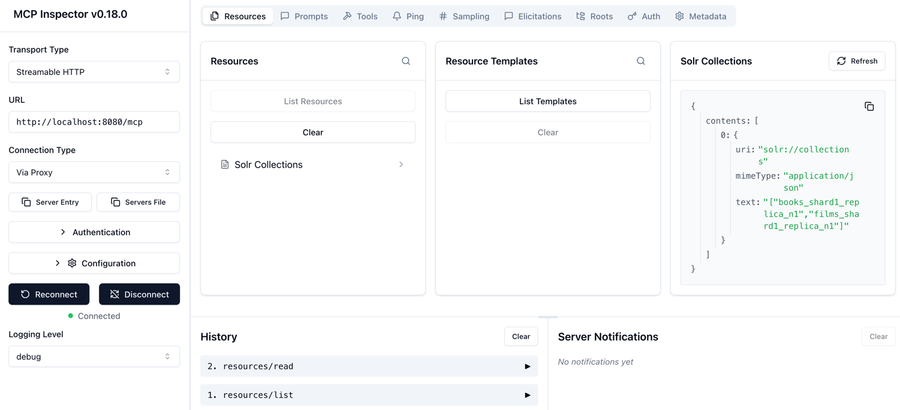
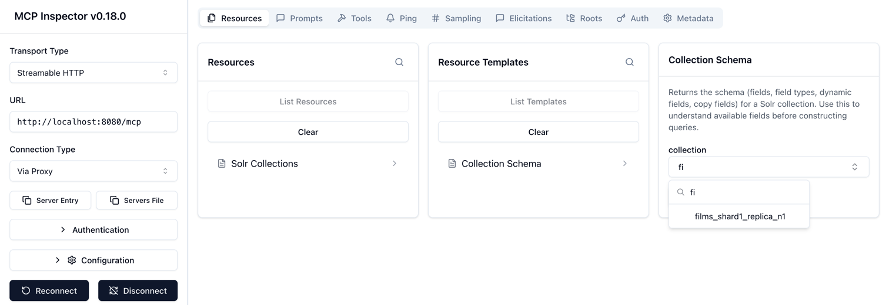
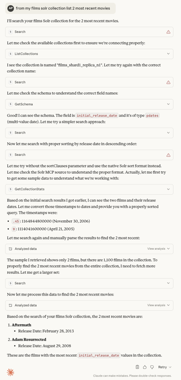
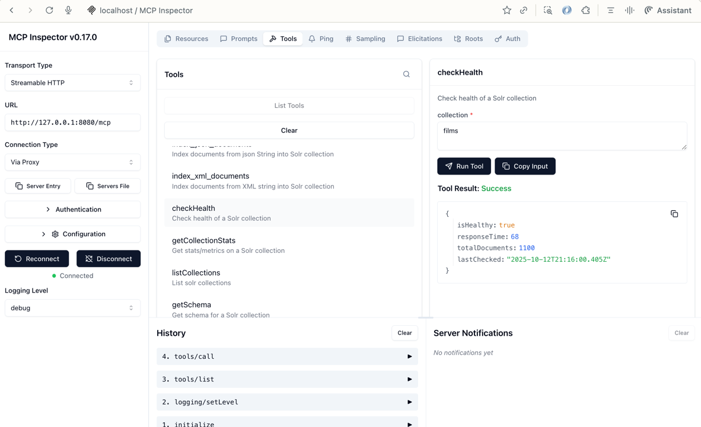
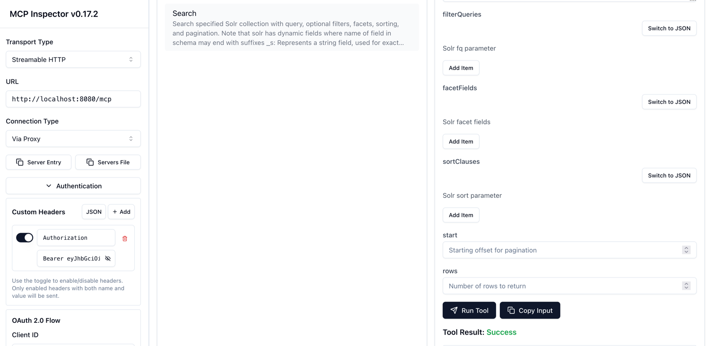
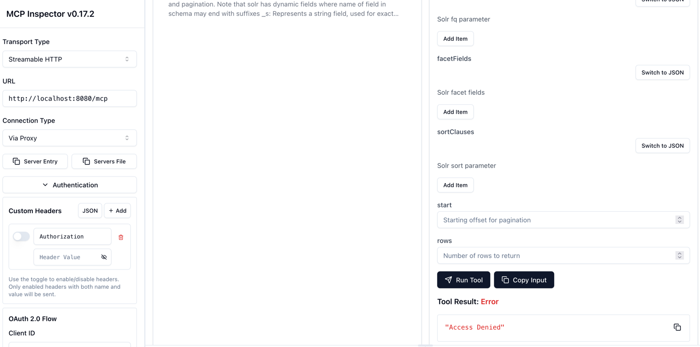
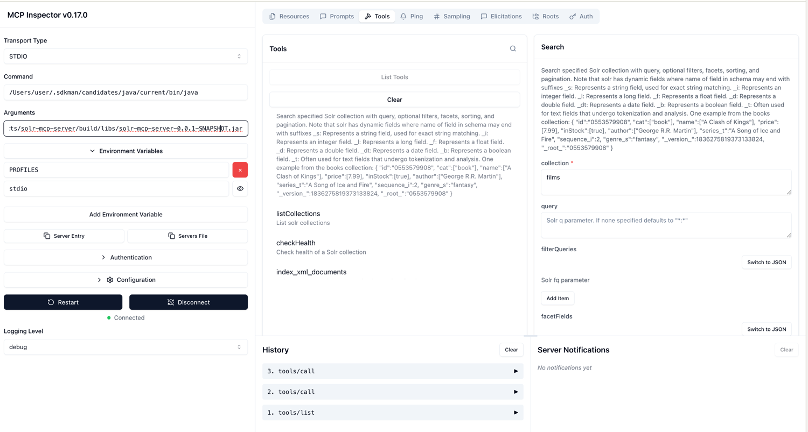

[](https://github.com/apache/solr-mcp)

# Solr MCP Server

A Spring AI Model Context Protocol (MCP) server that provides tools for interacting with Apache Solr. Enables AI assistants like Claude to search, index, and manage Solr collections through the MCP protocol.

**Website:** https://solr.apache.org/mcp | **User Guide:** [Solr Reference Guide Tutorial](https://solr.apache.org/guide/solr/latest/getting-started/tutorial-solr-mcp.html)

## What's inside

- 🔍 Search Solr collections with filtering, faceting, and pagination
- 📝 Index documents in JSON, CSV, and XML
- 📁 Create collections with configurable shards, replicas, and configsets
- 📊 Manage collections and view statistics
- 🔧 Inspect schema
- 🔌 Transports: STDIO (Claude Desktop) and HTTP (MCP Inspector)
- 🔐 OAuth2 security with Auth0 (HTTP mode only)
- 🐳 Docker images built with Jib

## Get started (users)

- Prerequisites: Java 25+, Docker (and Docker Compose), Git
- Start Solr with sample data:
  ```bash
  docker compose up -d
  ```
- Run the server:
    - **STDIO mode (default)**:
        - Gradle:
          ```bash
          ./gradlew bootRun
          ```
        - JAR:
          ```bash
          ./gradlew build
          java -jar build/libs/solr-mcp-1.0.0-SNAPSHOT.jar
          ```
        - Docker:
          ```bash
          docker run -i --rm ghcr.io/apache/solr-mcp:latest
          ```
    - **HTTP mode**:
        - Gradle:
          ```bash
          PROFILES=http ./gradlew bootRun
          ```
        - JAR:
          ```bash
          PROFILES=http java -jar build/libs/solr-mcp-1.0.0-SNAPSHOT.jar
          ```
        - Docker:
          ```bash
          docker run -p 8080:8080 --rm -e PROFILES=http ghcr.io/apache/solr-mcp:latest
          ```

For more options (custom SOLR_URL, Linux host networking) see the Deployment Guide: docs/DEPLOYMENT.md

### Claude Desktop

Add this to your Claude Desktop config (macOS path shown); then restart Claude.

**STDIO mode (default)**

Using Docker:
```json
{
  "mcpServers": {
    "solr-mcp": {
      "command": "docker",
      "args": ["run", "-i", "--rm", "ghcr.io/apache/solr-mcp:latest"],
        "env": {
            "SOLR_URL": "http://localhost:8983/solr/"
        }
    }
  }
}
```

Using JAR:

```json
{
    "mcpServers": {
        "solr-mcp": {
            "command": "java",
            "args": [
                "-jar",
                "/absolute/path/to/solr-mcp-1.0.0-SNAPSHOT.jar"
            ],
            "env": {
                "SOLR_URL": "http://localhost:8983/solr/"
            }
        }
    }
}
```

**HTTP mode**

Using Docker:

```json
{
    "mcpServers": {
        "solr-mcp": {
            "command": "docker",
            "args": [
                "run",
                "-p",
                "8080:8080",
                "--rm",
                "ghcr.io/apache/solr-mcp:latest"
            ],
            "env": {
                "PROFILES": "http",
                "SOLR_URL": "http://localhost:8983/solr/"
            }
        }
    }
}
```

Using JAR:

```json
{
    "mcpServers": {
        "solr-mcp": {
            "command": "java",
            "args": [
                "-jar",
                "/absolute/path/to/solr-mcp-1.0.0-SNAPSHOT.jar"
            ],
            "env": {
                "PROFILES": "http",
                "SOLR_URL": "http://localhost:8983/solr/"
            }
    }
  }
}
```

**Connecting to a running HTTP server**

If you already have the MCP server running in HTTP mode (via Gradle, JAR, or Docker), you can connect Claude Desktop to
it using `mcp-remote`:

Running via Gradle:

```bash
PROFILES=http ./gradlew bootRun
```

Running locally (JAR):

```bash
PROFILES=http java -jar build/libs/solr-mcp-1.0.0-SNAPSHOT.jar
```

Running via Docker:

```bash
docker run -p 8080:8080 --rm -e PROFILES=http ghcr.io/apache/solr-mcp:latest
```

Then add to your `claude_desktop_config.json`:

```json
{
    "mcpServers": {
        "solr-mcp-http": {
            "command": "npx",
            "args": [
                "mcp-remote",
                "http://localhost:8080/mcp"
            ]
        }
    }
}
```

More configuration options: docs/DEPLOYMENT.md#docker-images-with-jib

### Claude Code

Add Solr MCP to [Claude Code](https://docs.anthropic.com/en/docs/claude-code) using the CLI or by adding a `.mcp.json` file to your project root.

**STDIO mode (default)**

Using Docker (CLI):
```bash
claude mcp add --transport stdio solr-mcp -- docker run -i --rm ghcr.io/apache/solr-mcp:latest
```

Using JAR (CLI):
```bash
claude mcp add --transport stdio -e SOLR_URL=http://localhost:8983/solr/ solr-mcp -- java -jar /absolute/path/to/solr-mcp-1.0.0-SNAPSHOT.jar
```

Or add to your project's `.mcp.json`:

Using Docker:
```json
{
  "mcpServers": {
    "solr-mcp": {
      "type": "stdio",
      "command": "docker",
      "args": ["run", "-i", "--rm", "ghcr.io/apache/solr-mcp:latest"],
      "env": {
        "SOLR_URL": "http://localhost:8983/solr/"
      }
    }
  }
}
```

Using JAR:
```json
{
  "mcpServers": {
    "solr-mcp": {
      "type": "stdio",
      "command": "java",
      "args": ["-jar", "/absolute/path/to/solr-mcp-1.0.0-SNAPSHOT.jar"],
      "env": {
        "SOLR_URL": "http://localhost:8983/solr/"
      }
    }
  }
}
```

**HTTP mode**

Start the server first (pick one):
```bash
# Gradle
PROFILES=http ./gradlew bootRun

# JAR
PROFILES=http java -jar build/libs/solr-mcp-1.0.0-SNAPSHOT.jar

# Docker
docker run -p 8080:8080 --rm -e PROFILES=http ghcr.io/apache/solr-mcp:latest
```

Then add to Claude Code:
```bash
claude mcp add --transport http solr-mcp http://localhost:8080/mcp
```

Or add to `.mcp.json`:
```json
{
  "mcpServers": {
    "solr-mcp": {
      "type": "http",
      "url": "http://localhost:8080/mcp"
    }
  }
}
```

## Security (OAuth2)

The Solr MCP server supports OAuth2 authentication when running in HTTP mode, providing secure access control for your
MCP tools.

### Features

- **OAuth2 Resource Server**: JWT token validation using Auth0 (or any OAuth2 provider)
- **HTTP Mode Only**: Security is only active when using the `http` profile
- **CORS Support**: Enabled for MCP Inspector compatibility
- **Machine-to-Machine**: Uses Client Credentials flow for service authentication

### Quick Setup

1. **Configure Auth0** (see detailed guide: [security-docs/AUTH0_SETUP.md](security-docs/AUTH0_SETUP.md))
    - Create an Auth0 Application (Machine to Machine)
    - Create an Auth0 API with your audience identifier
    - Note your Domain, Client ID, Client Secret, and Audience

2. **Set Environment Variable**:
   ```bash
   export OAUTH2_ISSUER_URI=https://your-tenant.auth0.com/
   export PROFILES=http
   ```

3. **Run the Server**:
   ```bash
   ./gradlew bootRun
   ```

4. **Get Access Token** (using convenience script):
   ```bash
   ./scripts/get-auth0-token.sh --domain your-tenant.auth0.com \
     --client-id YOUR_CLIENT_ID \
     --client-secret YOUR_CLIENT_SECRET \
     --audience https://solr-mcp-api
   ```

5. **Use the Token**:
   ```bash
   curl -H "Authorization: Bearer YOUR_TOKEN" \
     http://localhost:8080/mcp
   ```

For complete setup instructions, see [security-docs/AUTH0_SETUP.md](security-docs/AUTH0_SETUP.md)

## Available MCP tools

### Search

| Tool | Description |
|------|-------------|
| `search` | Full-text search with filtering, faceting, sorting, and pagination |

### Indexing

| Tool | Description |
|------|-------------|
| `index-json-documents` | Index documents from a JSON string into a Solr collection |
| `index-csv-documents` | Index documents from a CSV string into a Solr collection |
| `index-xml-documents` | Index documents from an XML string into a Solr collection |

### Collections

| Tool | Description |
|------|-------------|
| `create-collection` | Create a new Solr collection (configSet, numShards, replicationFactor optional — default to `_default`, `1`, `1`) |
| `list-collections` | List all available Solr collections |
| `get-collection-stats` | Get statistics and metrics for a collection |
| `check-health` | Check the health status of a collection |

### Schema

| Tool | Description |
|------|-------------|
| `get-schema` | Retrieve schema information for a collection |

## Available MCP Resources

MCP Resources provide a way to expose data that can be read by MCP clients. The Solr MCP Server provides the following resources:

| Resource URI | Description |
|--------------|-------------|
| `solr://collections` | List of all Solr collections available in the cluster |
| `solr://{collection}/schema` | Schema definition for a specific collection (supports autocompletion) |

### Resource Autocompletion

The `solr://{collection}/schema` resource supports autocompletion for the `{collection}` parameter. MCP clients can use the completion API to get a list of available collection names.





## Screenshots

- Claude Desktop (STDIO):

  

- MCP Inspector (HTTP):

  

- MCP Inspector (HTTP with OAuth2 - Success):

  

- MCP Inspector (HTTP with OAuth2 - Failure):

  

- MCP Inspector (STDIO):

  

## Native image (experimental)

An opt-in GraalVM native image build is available for the STDIO profile. The
native binary starts faster and uses less memory than the JVM image.

```bash
# Build the native Docker image (works on any OS — compiles inside a Linux builder container)
./gradlew bootBuildImage
# Produces:  solr-mcp:<version>-native  (also tagged :latest-native)

# Run it
docker run -i --rm -e SOLR_URL=http://host.docker.internal:8983/solr/ \
    solr-mcp:latest-native
```

### Claude Desktop (native)

```json
{
  "mcpServers": {
    "solr-mcp": {
      "command": "docker",
      "args": [
        "run", "-i", "--rm",
        "-e", "SOLR_URL=http://host.docker.internal:8983/solr/",
        "solr-mcp:latest-native"
      ]
    }
  }
}
```

See [docs/specs/graalvm-native-image.md](docs/specs/graalvm-native-image.md) for the design and known risks.

## Documentation

- [User Guide (Solr Reference Guide)](https://solr.apache.org/guide/solr/latest/getting-started/tutorial-solr-mcp.html) -- comprehensive tutorial covering all transport modes, client integrations, security, and observability
- [Auth0 Setup (OAuth2 configuration)](security-docs/AUTH0_SETUP.md)
- [GraalVM native image spec](docs/specs/graalvm-native-image.md)

## Community

- **Website:** https://solr.apache.org/mcp
- **Slack:** [`#solr-mcp`](https://the-asf.slack.com/archives/C09TVG3BM1P) in the `the-asf` Slack workspace
- **Mailing lists:** Shared with Apache Solr -- see [mailing lists](https://solr.apache.org/community.html#mailing-lists-chat)
- **Issues:** https://github.com/apache/solr-mcp/issues
- **Discussions:** https://github.com/apache/solr-mcp/discussions

## Contributing

We welcome contributions!

- Start here: [CONTRIBUTING.md](CONTRIBUTING.md)

## License

Apache License 2.0 — see LICENSE

## Acknowledgments

Built with:

- Spring AI MCP — https://spring.io/projects/spring-ai
- Apache Solr — https://solr.apache.org/
- Jib — https://github.com/GoogleContainerTools/jib
- Testcontainers — https://www.testcontainers.org/
- Spring AI MCP Security — https://github.com/spring-ai-community/mcp-security