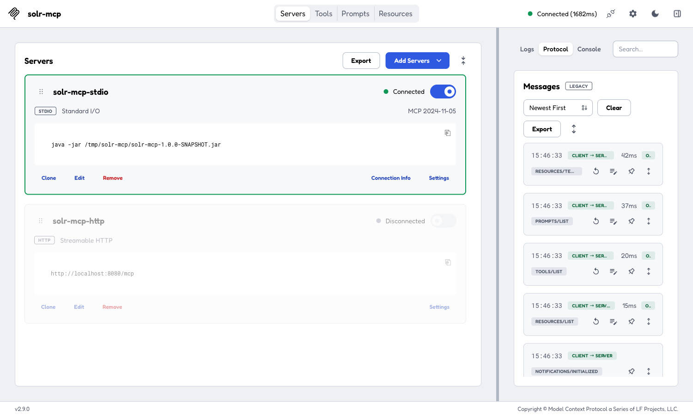
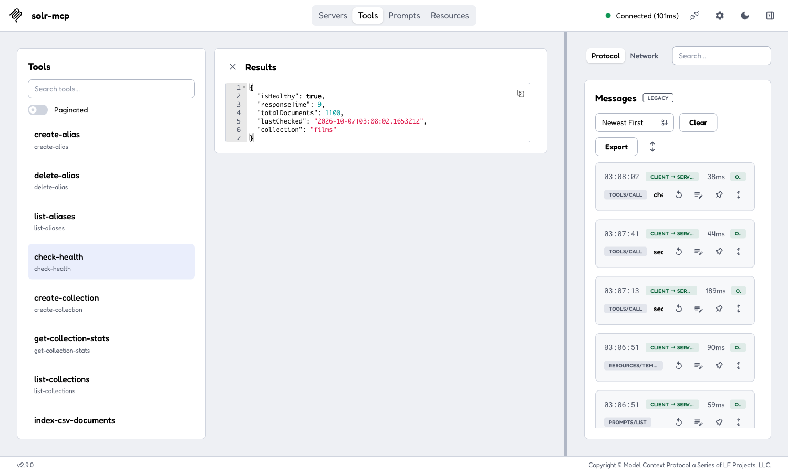
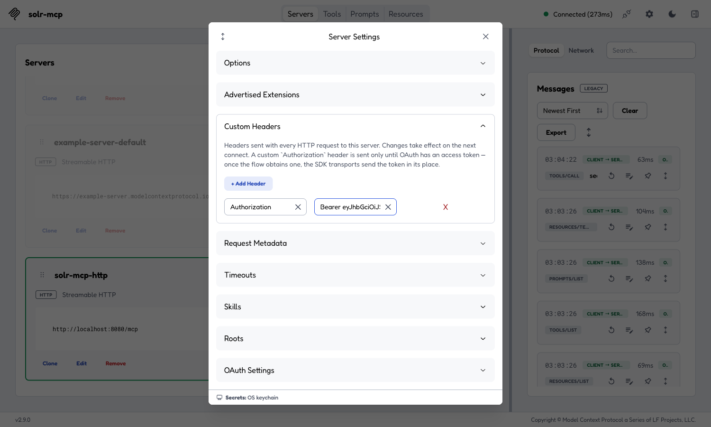
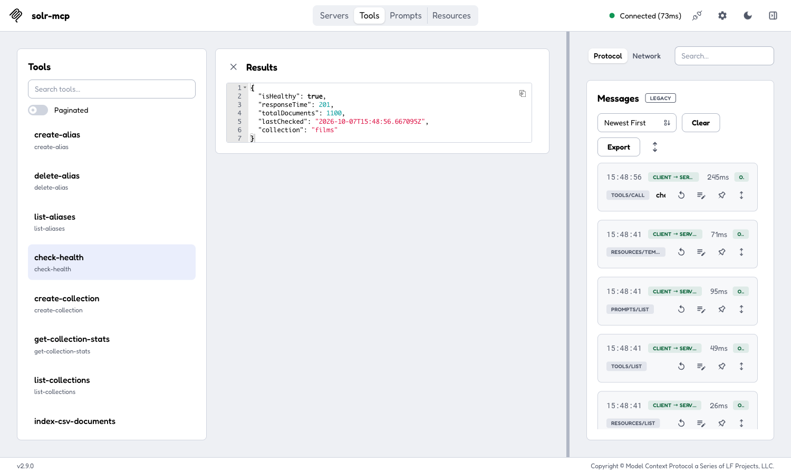
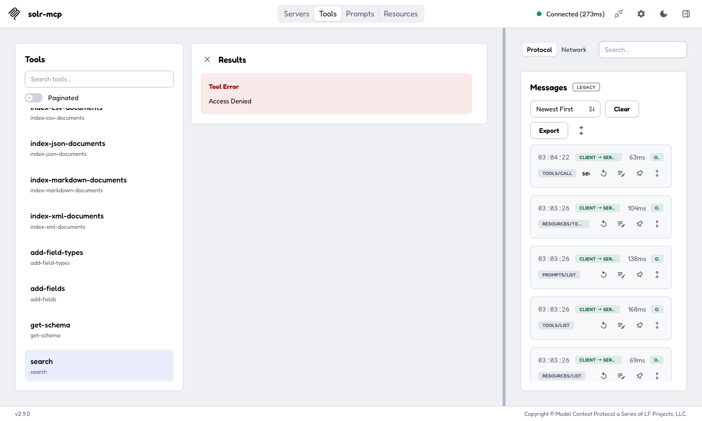
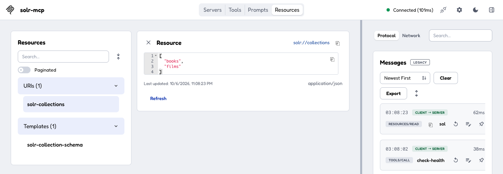
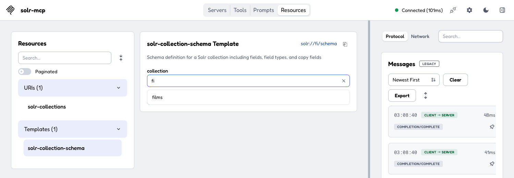

# MCP Inspector

The [MCP Inspector](https://github.com/modelcontextprotocol/inspector) is a web-based tool for testing and debugging MCP servers. It lets you browse available tools, invoke them interactively, and inspect responses.

These steps are for Inspector v2 (checked against v2.9.0). The older 0.x releases have a different layout.

### Install ###

```bash
npx @modelcontextprotocol/inspector
```

This starts the Inspector UI at `http://localhost:6274` and opens it in your browser. The terminal prints the URL with its session token (`?MCP_INSPECTOR_API_TOKEN=…`); open that URL if no browser window appears.

Servers are added from the **Servers** page with **Add Servers → + Add manually**, and saved to `~/.mcp-inspector/mcp.json`. Connect a server with the toggle on its card; the **Tools**, **Prompts** and **Resources** tabs then work against it.

***

## STDIO Mode ##

1. **Add Servers → + Add manually**
2. **Server ID**: `solr-mcp`
3. **Transport**: `stdio (local process)`
4. **Command**: `java`
5. **Arguments** (one per line):

        -jar
        /absolute/path/to/solr-mcp-1.0.0-SNAPSHOT.jar

6. **Environment**: `SOLR_URL=http://localhost:8983/solr/`
7. Click **Add**, then switch the server's toggle on

The Inspector runs `java` from the `PATH` of the shell you started it in, and the server needs Java 25. If that `java` is older, put the full path to a Java 25 `java` in **Command**.



***

## HTTP Mode ##

1. Start the server in HTTP mode:

        # JAR
        PROFILES=http java -jar build/libs/solr-mcp-1.0.0-SNAPSHOT.jar

        # Or Gradle
        PROFILES=http ./gradlew bootRun

        # Or Docker (local image — build first with ./gradlew jibDockerBuild)
        docker run -p 8080:8080 --rm \
            -e PROFILES=http \
            -e SOLR_URL=http://host.docker.internal:8983/solr/ \
            solr-mcp:latest

    The HTTP transport is secured by default: without a bearer token the client still connects and lists the tools, but every tool call returns `Access Denied`. The server never answers `/mcp` with `401`, so no OAuth login starts. For a local experiment on your own machine only, add `HTTP_SECURITY_ENABLED=false` to the server's environment; see the [HTTP security model](../security/http.md) before exposing it to anyone else.

2. **Add Servers → + Add manually**
3. **Server ID**: `solr-mcp-http`
4. **Transport**: `streamable-http`
5. **URL**: `http://localhost:8080/mcp`
6. Click **Add**, then switch the server's toggle on

**Linux users** (Docker option): add `--add-host=host.docker.internal:host-gateway` to the `docker run` command.



***

## OAuth2 ##

Because the server never challenges `/mcp` with `401`, the Inspector's interactive OAuth flow (**Settings → OAuth Settings**) never starts. Send a bearer token as a custom header instead:

1. Get an access token from your provider. With the Keycloak realm that `compose.yaml` imports (start it with `docker compose --profile http up -d keycloak`, and run the server with `OAUTH2_ISSUER_URI=http://localhost:8180/realms/solr-mcp`):

        curl -s -X POST http://localhost:8180/realms/solr-mcp/protocol/openid-connect/token \
          -d grant_type=client_credentials \
          -d client_id=solr-mcp-service \
          -d client_secret=dev-only-not-a-secret | jq -r .access_token

2. On the server's card, open **Settings → Custom Headers → + Add Header**
3. Set the key to `Authorization` and the value to `Bearer <token>`
4. Switch the server's toggle off and on again; headers take effect on the next connect

The token's audience must match the URL the Inspector connects to, so use `http://localhost:8080/mcp` rather than `127.0.0.1` with the Keycloak realm above.



With a valid token, tool calls succeed:



Without one, every tool call returns `Access Denied`:



See the [HTTP security model](../security/http.md) for server-side OAuth2 setup with [Auth0](../security/auth0.md) and [Keycloak](../security/keycloak.md).

***

## Resources and completions ##

The **Resources** tab lists `solr://collections` and the `solr://{collection}/schema` template:



Typing into the template's `collection` field asks the server for completions, which come back as live collection names:


